# 🌦️ Weatherly

<div align="center">

A modern, responsive weather forecasting application built with **React**, **TypeScript**, **Vite**, and **Tailwind CSS**.

Real-time weather • 5-Day Forecast • Current Location • Beautiful Animations

[Live Demo](https://weatherly-app-self.vercel.app)

</div>

---

## 📌 Overview

Weatherly is a modern weather application that provides real-time weather information and a 5-day forecast for any city worldwide.

The application uses the **OpenWeather API** to fetch live weather data while providing a clean, responsive, and animated user interface. It supports searching by city name, detecting the user's current location, viewing detailed atmospheric conditions, and dynamically changing the application's background based on weather conditions.

Designed with performance, usability, and clean architecture in mind, Weatherly demonstrates modern frontend development practices using React and TypeScript.

---

## ✨ Features

- 🌍 Search weather by city name
- 📍 Detect current location using Geolocation API
- 🌤 Live weather information
- 📅 5-Day weather forecast
- 🌅 Sunrise & Sunset timings
- 🌡 Temperature, Feels Like
- 💨 Wind Speed
- 💧 Humidity
- 👁 Visibility
- 📈 Atmospheric Pressure
- 🎨 Dynamic animated background based on weather
- 🌙 Beautiful Dark UI
- ⚡ Fast performance with Vite
- 📱 Fully Responsive Design
- 💾 Search History using Local Storage
- ❌ Error Handling
- ⏳ Skeleton Loading Animation

---

# 🛠️ Tech Stack

| Category | Technologies |
|----------|--------------|
| Frontend | React 19, TypeScript |
| Build Tool | Vite |
| Styling | Tailwind CSS |
| Animation | Framer Motion |
| Icons | React Icons |
| HTTP Client | Axios |
| Weather API | OpenWeather API |
| State Management | React Hooks |
| Storage | Local Storage |
| Deployment | Vercel |

---

# 🏗️ Project Architecture

```
Weatherly
│
├── User
│
├── Search City / Detect Location
│
├── Weather Service (Axios)
│
├── OpenWeather API
│
├── Weather Response
│
├── React State Management
│
├── UI Components
│      │
│      ├── Navbar
│      ├── Search Bar
│      ├── Weather Card
│      ├── Weather Details
│      ├── Forecast
│      ├── Search History
│      ├── Unit Toggle
│      └── Animated Background
│
└── Render Beautiful Dashboard
```

---

# 📂 Project Structure

```
weather-app/
│
├── public/
│   ├── weatherly.svg
│   └── favicon.ico
│
├── src/
│   ├── assets/
│   │
│   ├── components/
│   │   ├── background/
│   │   ├── common/
│   │   ├── forecast/
│   │   ├── layout/
│   │   ├── search/
│   │   └── weather/
│   │
│   ├── services/
│   │   └── weatherApi.ts
│   │
│   ├── types/
│   │
│   ├── constants/
│   │
│   ├── App.tsx
│   └── main.tsx
│
├── .env
├── package.json
├── vite.config.ts
└── README.md
```

---

# ⚙️ Technologies Used

- React
- TypeScript
- Vite
- Tailwind CSS
- Axios
- Framer Motion
- React Icons
- OpenWeather API
- Vercel

# 🚀 Getting Started

Follow these steps to set up the project locally.

---

## 1️⃣ Clone the Repository

```bash
git clone https://github.com/varunwalia120/weather-app.git
```

Navigate into the project directory.

```bash
cd weather-app
```

---

## 2️⃣ Install Dependencies

Using npm:

```bash
npm install
```

---

## 3️⃣ Configure Environment Variables

Create a `.env` file in the root directory.

```env
VITE_WEATHER_API_KEY=YOUR_OPENWEATHER_API_KEY
```

> **Note**
>
> Obtain a free API key from:
>
> https://openweathermap.org/api

---

## 4️⃣ Run the Development Server

```bash
npm run dev
```

The application will be available at:

```
http://localhost:5173
```

---

## 5️⃣ Build for Production

```bash
npm run build
```

---

## 6️⃣ Preview the Production Build

```bash
npm run preview
```

---

# 🌐 Deployment

This project is deployed on **Vercel**.

Deployment process:

1. Push the repository to GitHub.
2. Import the repository into Vercel.
3. Add the following Environment Variable.

```env
VITE_WEATHER_API_KEY=YOUR_OPENWEATHER_API_KEY
```

4. Redeploy the application.

---

# 📦 Available Scripts

| Command | Description |
|----------|-------------|
| `npm install` | Install dependencies |
| `npm run dev` | Start development server |
| `npm run build` | Create production build |
| `npm run preview` | Preview production build |
| `npm run lint` | Run ESLint |

---

# 🔐 Environment Variables

| Variable | Description |
|----------|-------------|
| `VITE_WEATHER_API_KEY` | OpenWeather API Key |

> ⚠️ Never commit your `.env` file to GitHub.

# 📸 Application Preview

## 🏠 Landing Page

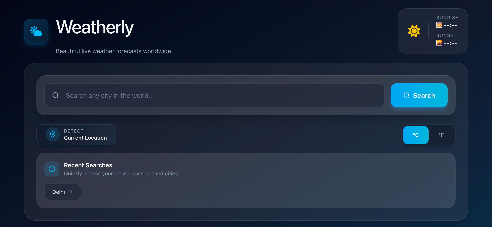

---

## 🌦 Weather Dashboard

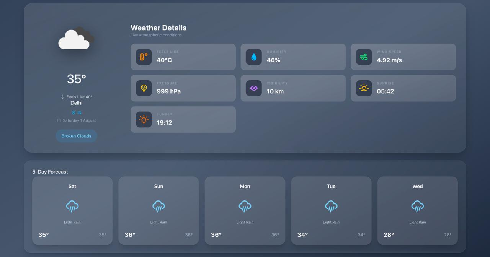

---

## 📅 Five Day Forecast

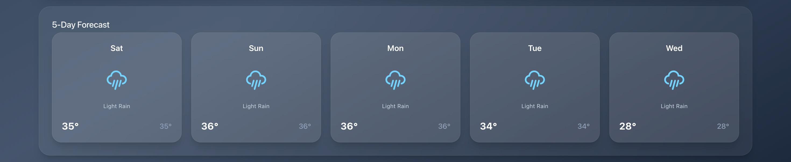

---

## 📍 Current Location

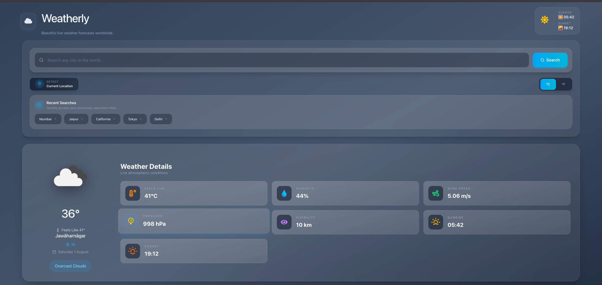

---

## 🔎 Search History


---

## ⌛ Loading State

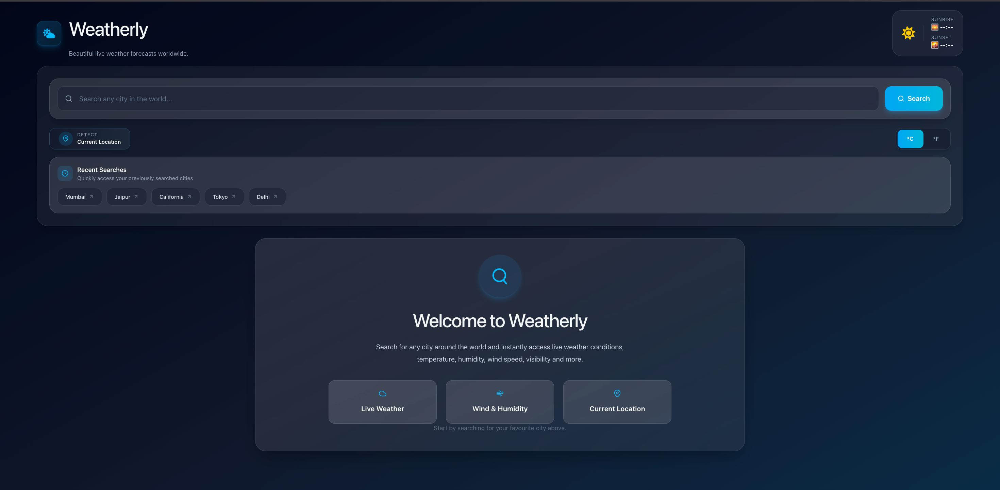

---

## ❌ Error Handling

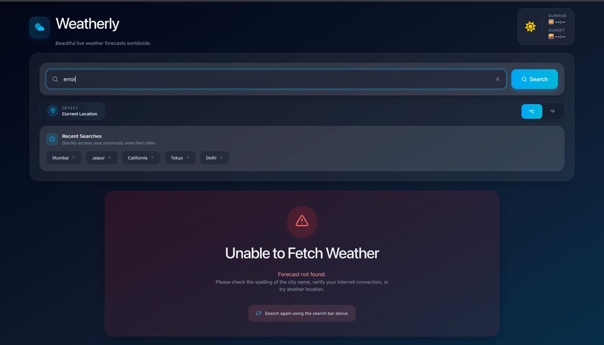

---

## 📱 Responsive Design

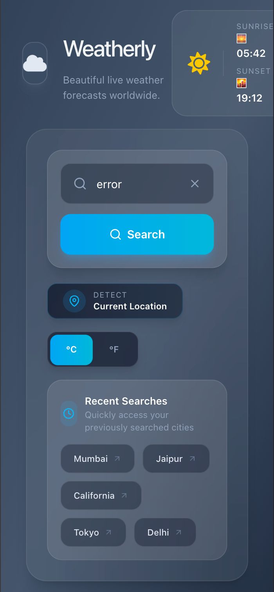

---

# 🎨 UI Highlights

- 🌈 Dynamic Animated Background
- 🎭 Smooth Framer Motion Animations
- 🌙 Modern Dark Theme
- 📱 Fully Responsive Layout
- 🎯 Interactive Hover Effects
- ⚡ Fast Page Rendering
- 🎨 Glassmorphism Cards
- 🔄 Animated Weather Icons
- 💡 Clean Minimal Design

# 🏗️ System Architecture

## 🌐 High-Level Architecture

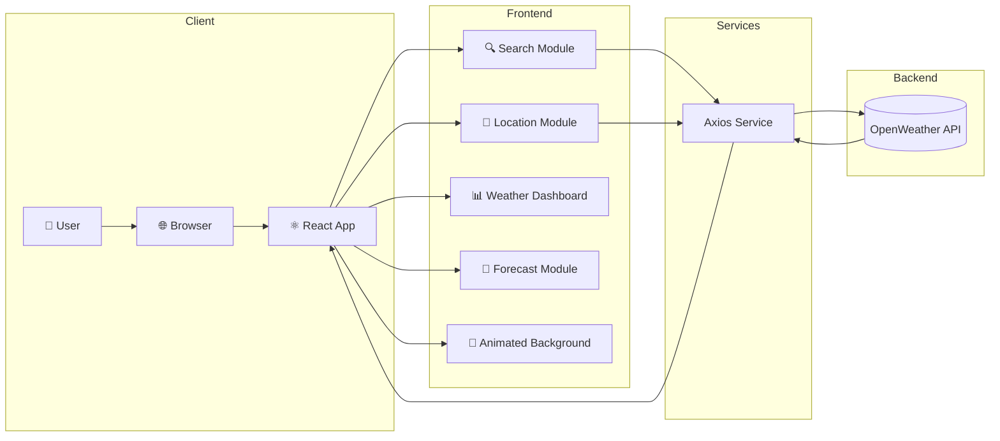
## ⚛️ React Component Architecture

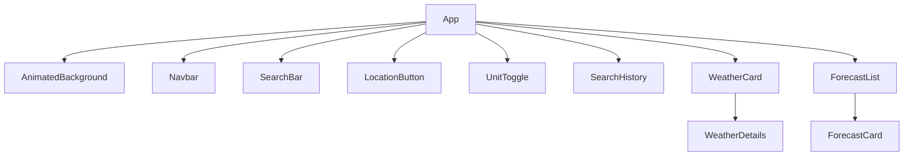
## 🔍 Search Workflow

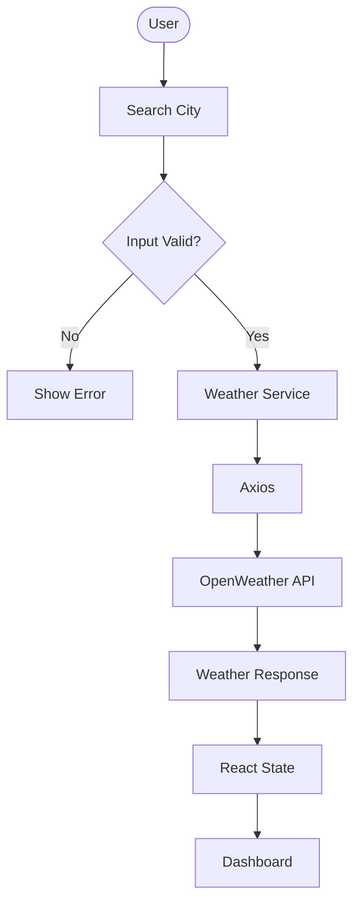
## 📍 Current Location

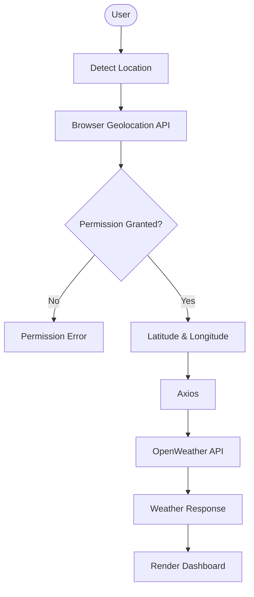

## 🧠 State Management

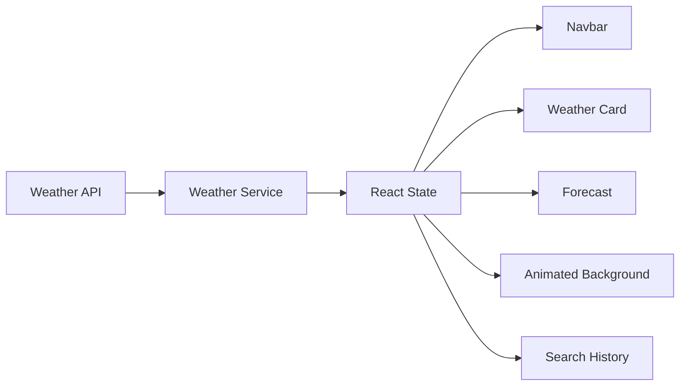

## 🚀 Deployment Pipeline

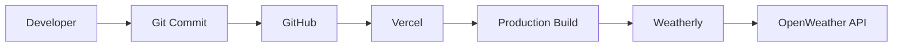

# 🚀 Key Features

## 🌍 Search Weather by City

- Search weather information for any city worldwide.
- Instant API requests with real-time updates.
- Input validation and error handling for invalid cities.

---

## 📍 Current Location Detection

- Uses the browser's Geolocation API.
- Fetches weather automatically based on latitude and longitude.
- Gracefully handles permission denial.

---

## 📅 5-Day Weather Forecast

- Displays daily forecast cards.
- Shows:
  - Weather condition
  - Minimum temperature
  - Maximum temperature
  - Weather icon
  - Day of the week

---

## 🌤 Dynamic Background

The application automatically changes its background according to the current weather.

Examples:

| Weather | Background |
|---------|------------|
| ☀️ Clear | Blue Sky |
| ☁️ Clouds | Gray |
| 🌧 Rain | Dark Blue |
| ❄️ Snow | White |
| ⛈ Thunderstorm | Purple |
| 🌫 Mist | Fog Gray |

---

## 🌡 Detailed Weather Information

Weatherly displays:

- Temperature
- Feels Like
- Humidity
- Wind Speed
- Pressure
- Visibility
- Sunrise
- Sunset

---

## 💾 Search History

Recently searched cities are stored using Local Storage.

Features include:

- Duplicate removal
- Maximum history limit
- One-click search
- Persistent storage

---

## 🌍 Unit Conversion

Switch between:

- Celsius (°C)
- Fahrenheit (°F)

without refreshing the application.

---

## ✨ Smooth Animations

Built using Framer Motion.

Animations include:

- Page transitions
- Hover effects
- Weather icon animations
- Background transitions
- Forecast card animations

---

## 📱 Responsive Design

Optimized for:

- Desktop
- Laptop
- Tablet
- Mobile

# 💡 Design Decisions

Several design choices were made to improve maintainability and user experience.

### Why React?

- Component-based architecture
- Efficient rendering
- Easy state management

### Why TypeScript?

- Type safety
- Better IntelliSense
- Reduced runtime bugs

### Why Tailwind CSS?

- Rapid UI development
- Utility-first styling
- Consistent design

### Why Axios?

- Cleaner API requests
- Better error handling
- Request configuration

### Why Framer Motion?

- Smooth animations
- Modern user experience
- Declarative animation API

# 🛠️ Challenges Faced

During the development of Weatherly, several technical challenges were encountered. Each challenge helped improve the application's architecture and overall development experience.

---

## 1. Integrating the OpenWeather API

### Challenge

Fetching real-time weather and forecast data while handling different API endpoints and response formats.

### Solution

- Created a dedicated weather service using Axios.
- Added reusable functions for city-based and coordinate-based requests.
- Implemented centralized error handling.

---

## 2. Managing API Errors

### Challenge

Users could enter invalid city names or experience API failures.

### Solution

Implemented custom error messages for:

- Invalid city
- Invalid API key
- Network failure
- Unknown errors

---

## 3. Geolocation Support

### Challenge

Obtaining the user's location while handling browser permissions.

### Solution

Used the Browser Geolocation API and displayed meaningful messages when permission was denied.

---

## 4. Search History Management

### Challenge

Preventing duplicate searches while keeping recent searches available.

### Solution

- Stored history using Local Storage.
- Removed duplicates automatically.
- Limited history to recent searches.

---

## 5. Forecast Data Processing

### Challenge

The OpenWeather Forecast API returns weather every 3 hours instead of one forecast per day.

### Solution

Processed the API response and grouped forecast entries to display a clean 5-day forecast.

---

## 6. Dynamic Background

### Challenge

Creating an immersive UI that changes with weather conditions.

### Solution

Mapped weather conditions to custom animated gradients using Framer Motion.

---

## 7. Deployment on Vercel

### Challenge

The application worked locally but returned **401 Unauthorized** after deployment.

### Solution

Configured the required environment variable in Vercel:

```env
VITE_WEATHER_API_KEY=YOUR_API_KEY
```

Redeployed the application to apply the updated environment variables.

---

## 8. Responsive UI

### Challenge

Maintaining a consistent layout across desktop, tablet, and mobile devices.

### Solution

Built the interface using Tailwind CSS responsive utilities and flexible layouts.

# 📚 Lessons Learned

This project helped strengthen my understanding of:

- React component architecture
- TypeScript interfaces and type safety
- API integration using Axios
- State management with React Hooks
- Browser Geolocation API
- Local Storage
- Responsive UI development
- Framer Motion animations
- Environment variables
- Vercel deployment
- Debugging production issues
- Organizing scalable frontend projects

# 🎯 Skills Demonstrated

### Frontend Development

- React
- TypeScript
- Tailwind CSS
- Responsive Design

### API Integration

- Axios
- REST APIs
- JSON Parsing

### UI/UX

- Framer Motion
- Glassmorphism
- Dynamic Themes
- Animations

### Development Practices

- Component-Based Architecture
- Code Reusability
- Error Handling
- Type Safety
- Local Storage